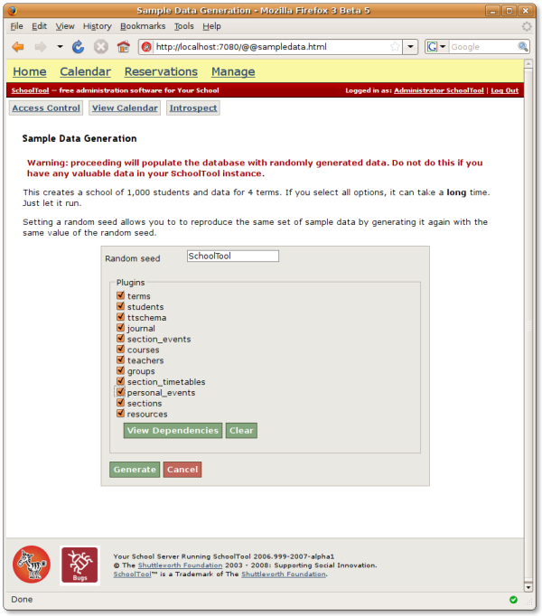
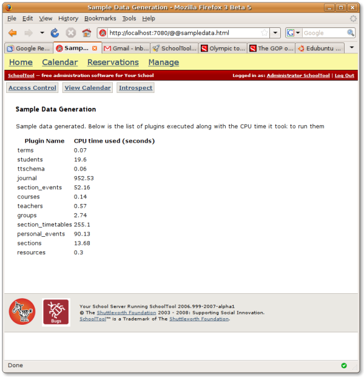
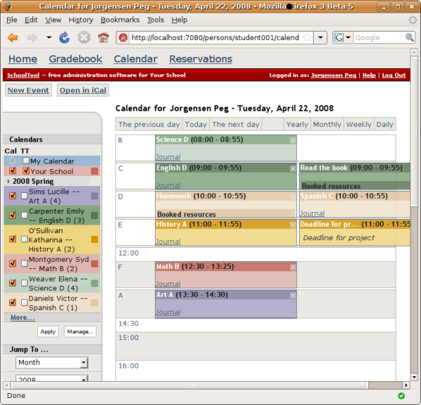

Generating Sample Data
======================

To make SchoolTool easier to test and evaluate, it has a built-in system for generating sample data.  The current system generates a fake school of 1000 students and creates fake data for four semesters (two years).  This provides a realistic sense of database responsiveness with a fully populated database.  Generating this data takes quite a bit of processor time, however.

SchoolTool has a special development mode called "devmode" that turns on several features which are handy for developing, testing, or setting up SchoolTool, but that should not be left on in a production system.  Sample data generation is one of these functions -- you don't want someone accidentally dumping a school of 1000 fake students on top of your real one.  As a reminder, when SchoolTool is in devmode the top of each page is yellow, instead of gray.

Turn on devmode by adding a line to the SchoolTool-2008 configuration file.  To do this you either need to be working directly on the server running SchoolTool, or through a remote ``ssh`` session.  First open the file for editing, replacing ``vi`` with the editor of your choice (``gedit``, ``nano``, etc.)::

  sudo vi /etc/schooltool/schooltool-2008/main.conf

Then add the following line to the file and save it::

  devmode on

And restart SchoolTool::

  sudo /etc/init.d/schooltool-2008 restart

When you reload SchoolTool in your browser (http://localhost:7080 if you're running it locally), the top of the screen should now be yellow, indicating devmode is active.  Note that it can take a while for SchoolTool to restart on some systems.  

Log in as the system manager (by default, **login:manager**, **password:schooltool**) click on the **Manage** link at the top of the screen, then the **Sample Data** link on the main Manage page.  This should take you to the sample data generation form.

Once again: **You do not want to do this on a system that contains any data you care about.**  This is only for testing.

You can select which kinds of data will be created, if you want to save time by only generating data relevant to the features you want to test.  If you only chose a few plugins, you can use the "View Dependencies" button to see if one of your choices requires some of the others.  For example, you can't have sections without students, teachers and courses.  

Pick what you want and hit **Generate.**  Most of these you'll want to select.  You might skip "journal," which generates attendance and daily grading data, "section_events," which creates random calendar events for sections (e.g., fake assignments),  and "personal_events," which creates fake personal calendar entries.

Note that a full set of data will create a database file of nearly 500 megabytes, and a temporary file the same size, so you'll need a free gigabyte of disk space if you want to generate everything at once.

Then, just leave the browser window open until the sample data generation completes.  This view isn't very sophisticated  -- it doesn't update you on its progress or give you any feedback until it completes.  You must leave this browser window open until you see this screen (or an error message):

For a full set of data, this can easily take up to a half an hour.  The journal plugin, for example, generating a random attendance event for every student in every section meeting in a school of 1000 students for two years.  So it is a lot of data generation. 

Once this has completed, you can repeat the steps above to remove the "devmode on" command from ``main.conf``, and restart the server in regular (not-devmode) mode.

You can now log in as a student or teacher.  The students' and teachers' passwords are the same as their usernames, which are either "student" or "teacher" followed by a three digit number, for example, "**student001**" or "**teacher001**".  You should see real-looking data in calendar and other views:

